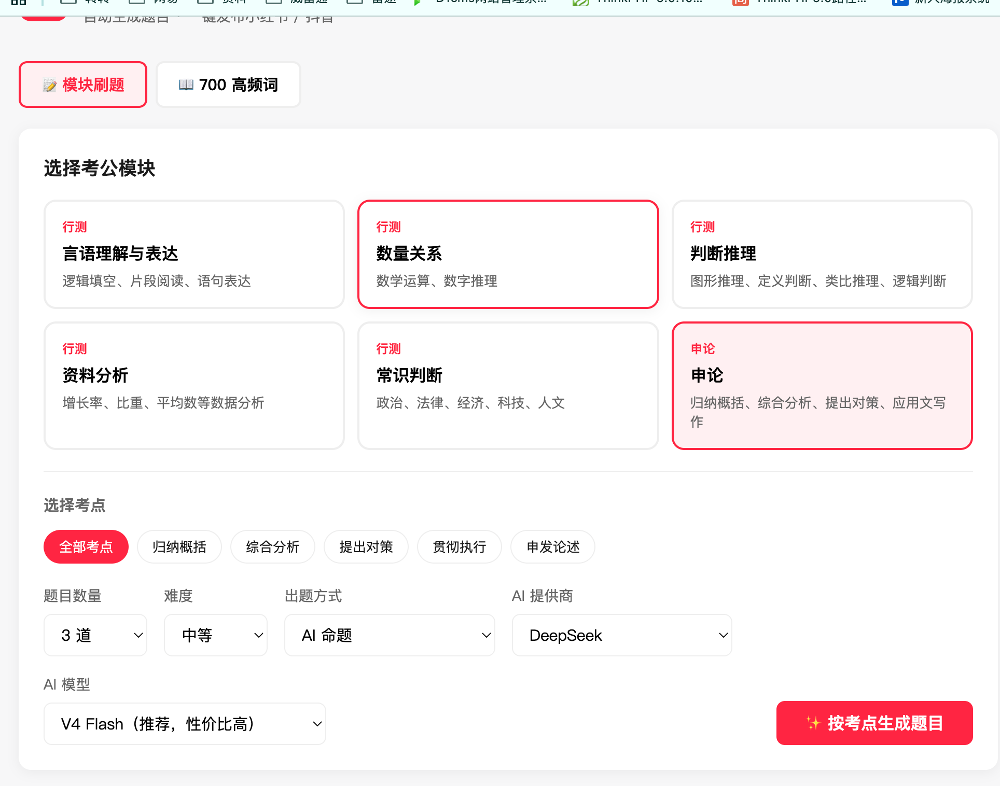
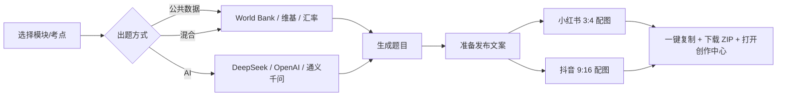
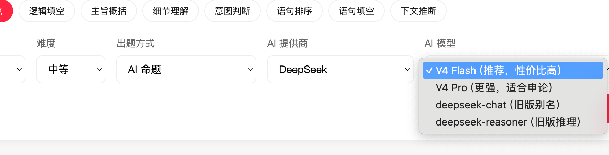
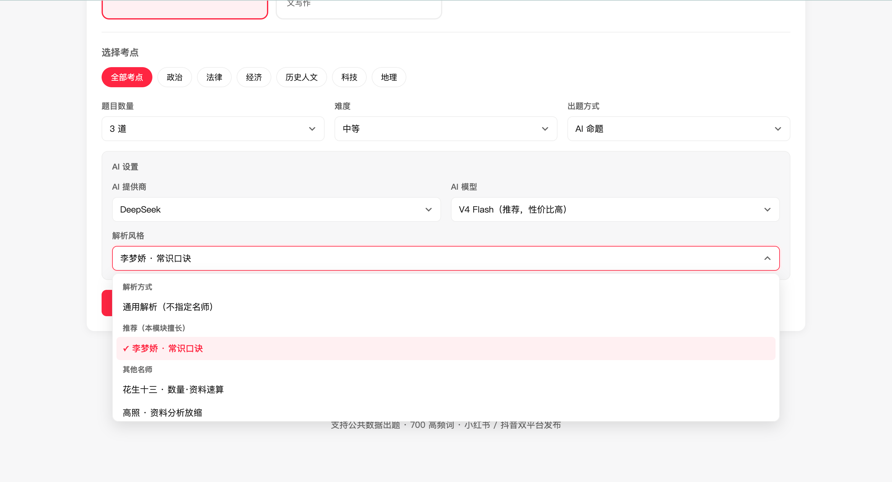
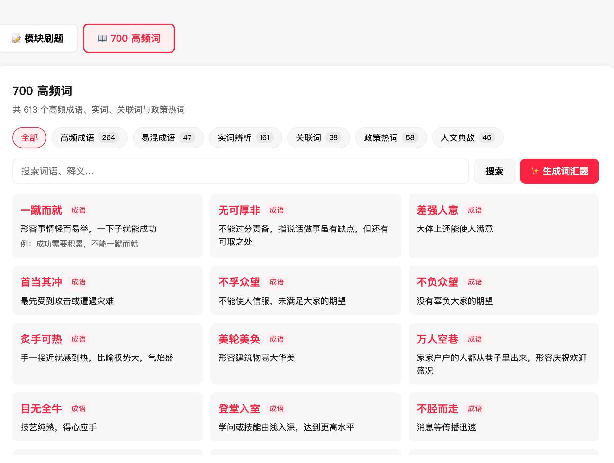
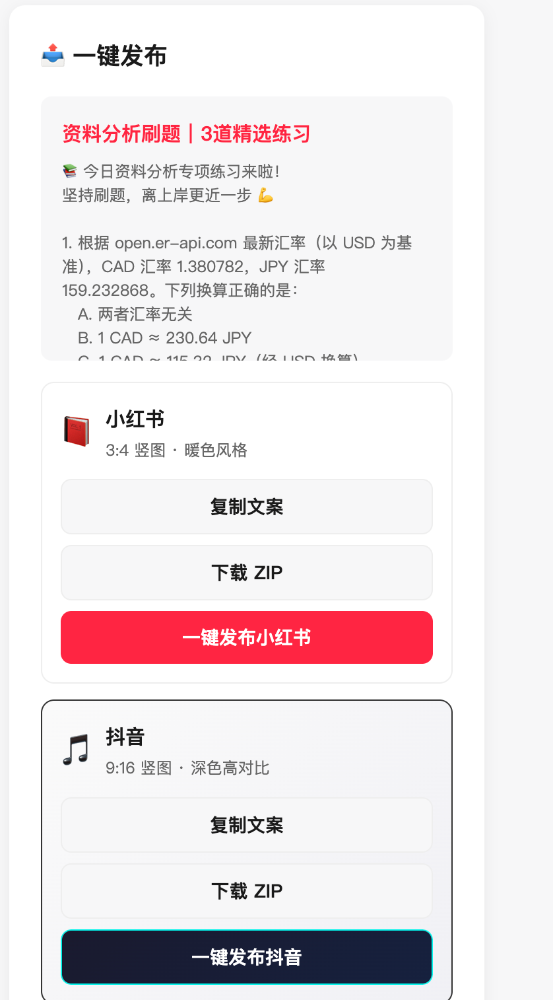

# 🐑🍊 考公助手 (kaogong-tool)

面向公务员考试备考的 **题目生成 + 双平台发布** 工具。支持公共数据实时出题、AI 按考点命题、700 高频词练习，并一键准备小红书 / 抖音图文素材。




---

## 系统介绍

### 它能做什么？



| 能力 | 说明 |
|------|------|
| **按考点出题** | 行测六大模块 + 细分考点（资料分析含增长率、比重、速算等） |
| **公共数据出题** | World Bank、REST Countries、维基百科、实时汇率，每次不同 |
| **AI 命题** | 配置 API Key 后按考点生成原创题，支持多提供商切换 |
| **700 高频词** | 626+ 成语、实词、关联词、政策热词随机抽题 |
| **双平台发布** | 自动生成文案 + 竖版配图，支持小红书 / 抖音半自动发布 |

### 技术架构

| 层级 | 技术 |
|------|------|
| 前端 | Vue 3 + Vite + TypeScript + html2canvas |
| 后端 | Express + TypeScript |
| 数据 | 公共开放 API（无需 Key）+ 可选 AI API |
| 配图 | 前端 Canvas 生成（小红书 1080×1440 / 抖音 1080×1920） |

---

## 快速开始

```bash
# 1. 安装依赖（需 Node 18+，推荐 22）
cd kaogong-tool
npm install
cd server && npm install && cd ..

# 2. 启动开发服务（前端 5173 + 后端 3456）
npm run dev
```

浏览器打开：**http://localhost:5173**

### 配置 AI（可选）

```bash
cd server
cp .env.example .env
# 编辑 .env，填入你要用的提供商 Key
```

**配置了 Key 的提供商才会在页面下拉中可选**，未配置的会显示「未配置 Key」并禁用。

| 提供商 | 环境变量 | 是否免费 |
|--------|----------|----------|
| **DeepSeek** | `DEEPSEEK_API_KEY` | API 按量付费，新用户有赠金 |
| **OpenAI** | `OPENAI_API_KEY` | 按量付费，**非免费** |
| **通义千问** | `QWEN_API_KEY` | 阿里云按量，有免费额度政策 |

兼容旧写法：`AI_API_KEY` 等同于 `DEEPSEEK_API_KEY`。

---

## 页面功能说明

### 1. 模块刷题


1. 选择考公模块（言语、数量、判断、资料、常识、申论）
2. 选择细分考点（如资料分析 → 速算比大小）
3. 设置题目数量、难度、出题方式
4. 点击 **「按考点生成题目」**

**出题方式：**

| 模式 | 适用场景 |
|------|----------|
| 公共数据 | 默认，免费，基于真实公开数据 |
| AI 命题 | 需配置 Key，原创度更高，适合申论/言语 |
| 混合 | 先公共数据，不足部分 AI 补全 |

选择「AI 命题」或「混合」后，会出现 **AI 提供商** 与 **AI 模型** 两个下拉框：已在 `server/.env` 中配置 Key 的提供商可选，未配置的会显示「未配置 Key」并禁用。



生成过程中可点击 **「取消生成」** 中止 AI 请求（流式模式，可节省 token）。
**解析风格：**
根据对应的模块 选择ai出问题以及解析的名师 


### 2. 700 高频词

切换到「700 高频词」Tab，按分类浏览或随机抽题，同样支持发布流程。



### 3. 发布到小红书 / 抖音



每个平台支持：

- 复制专属文案
- 下载配图 ZIP
- **一键发布**：复制文案 → 下载配图 → 打开创作中心

| 平台 | 创作中心 | 配图比例 |
|------|----------|----------|
| 小红书 | [creator.xiaohongshu.com](https://creator.xiaohongshu.com/publish/publish) | 3:4 暖色 |
| 抖音 | [creator.douyin.com](https://creator.douyin.com/creator-micro/content/upload) | 9:16 深色 |

---

## 考公备考建议

> 以下建议配合本工具使用，帮助你把「刷题 → 整理 → 发布/复盘」形成闭环。

### 行测：分模块突破

| 模块 | 建议 | 本工具怎么用 |
|------|------|----------------|
| **资料分析** | 先练速算（首数、放缩、分数转化），再练公式 | 选「资料分析 → 速算」考点 + 公共数据模式 |
| **言语理解** | 每天 20 道，总结主旨题标志词 | AI 模式 + 主旨/细节考点 |
| **判断推理** | 图形靠规律总结，定义题抓关键词 | 混合模式，保证题量 |
| **数量关系** | 不必全做，掌握工程/行程/利润几个套路 | 公共数据模式练计算 |
| **常识判断** | 广而不深，关注时政 | 公共数据自动拉国家/百科素材 |

### 申论：积累 + 输出

1. **归纳概括**：每天用 AI 生成 1 道申论题，限时 20 分钟写要点
2. **大作文**：每周 2 篇，用 DeepSeek V4 Pro 生成素材题
3. **发布复盘**：把优质练习发到小红书/抖音，评论区讨论 = 二次学习

### 700 高频词

- 每天 **30 个**，先看释义再做题
- 易混词（如「遏制/遏止」）单独整理到笔记本
- 用本工具随机抽题，错题标记反复刷

### 时间规划（参考）

```
06:30 - 07:00  700 高频词 30 个
12:00 - 12:30  资料分析速算 10 题
19:00 - 21:00  分模块专项（言语/判断/数量轮换）
21:00 - 21:30  申论 1 题 + 整理发布
```

### 使用 AI 的注意点

- DeepSeek **按 token 计费**，日常刷题用 V4 Flash 即可
- 解析仅供参考，**以官方教材和真题为准**
- 公共数据模式不消耗 AI 额度，适合大量刷题

---

## 项目结构

```
kaogong-tool/
├── src/                    # 前端 Vue 应用
│   ├── components/         # UI 组件
│   ├── api/                # API 封装
│   └── utils/xhsCard.ts    # 双平台配图生成
├── server/                 # 后端 Express
│   ├── src/
│   │   ├── config/         # AI 多提供商配置
│   │   ├── routes/         # API 路由
│   │   ├── services/       # 出题 / AI / 发布文案
│   │   └── data/           # 700 高频词数据
│   └── .env                # 本地密钥（勿提交 Git）
├── docs/images/            # README 截图目录
└── README.md
```

---

## 常用命令

```bash
npm run dev      # 开发模式
npm run build    # 生产构建
npm run preview  # 预览构建结果
```

## License

MIT · 小杨 🐑🍊
